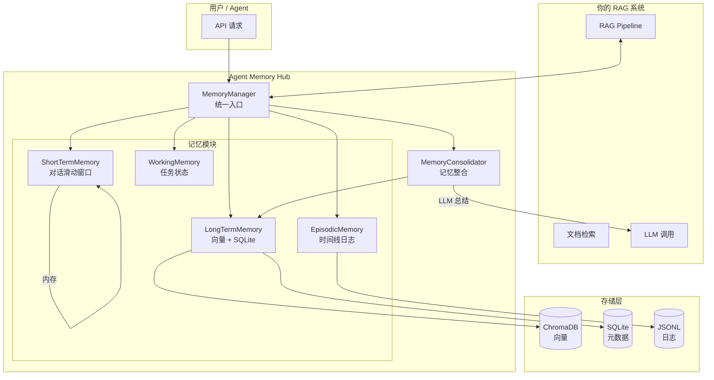

# Agent Memory Hub — 实现手册

> 本手册适用于为现有 RAG 项目添加 Agent Memory Hub 记忆管理能力。
> 所有代码可直接复制到项目中，按步骤操作即可。

---

## 📁 一、项目结构

在现有 RAG 项目根目录下，创建以下文件结构：

```
your-rag-project/
├── ...原有的 RAG 代码...
│
├── memory/                          # ← 新建：记忆模块
│   ├── __init__.py
│   ├── base.py                      # 记忆抽象基类
│   ├── short_term.py                # 短期记忆（对话滑动窗口）
│   ├── long_term.py                 # 长期记忆（向量存储 + 元数据）
│   ├── working.py                   # 工作记忆（任务状态）
│   ├── episodic.py                  # 情景记忆（时间线记录）
│   ├── manager.py                   # 统一记忆管理器
│   └── consolidation.py             # 记忆整合（总结压缩）
│
├── api/                             # ← 新建或合并：API 路由
│   ├── memory_routes.py             # 记忆管理 API
│   └── __init__.py
│
├── config.py                        # ← 新建或合并：配置管理
│
├── requirements.txt                 # ← 追加新依赖
│
└── IMPLEMENTATION_MANUAL.md         # ← 本手册
```

---

## 📦 二、安装依赖

```bash
# 如果使用 uv
uv add chromadb sentence-transformers openai fastapi uvicorn pydantic

# 如果使用 pip
pip install chromadb sentence-transformers openai fastapi uvicorn pydantic
```

---

## 🔧 三、配置文件

### `config.py`

```python
"""全局配置管理"""
import os
from dataclasses import dataclass, field
from pathlib import Path


@dataclass
class MemoryConfig:
    """记忆系统配置"""

    # --- 存储路径 ---
    chroma_path: str = "./data/chroma"           # 向量数据库路径
    sqlite_path: str = "./data/memory.db"        # SQLite 元数据路径
    episodic_path: str = "./data/episodic"      # 情景记忆日志路径

    # --- 短期记忆 ---
    short_term_max_messages: int = 50           # 最多保留消息数
    short_term_max_tokens: int = 4000           # 最多保留 token 数（估算）

    # --- 长期记忆 ---
    long_term_top_k: int = 5                    # 默认检索 Top K
    long_term_similarity_threshold: float = 0.5  # 相似度阈值

    # --- 嵌入模型 ---
    embedding_model: str = "all-MiniLM-L6-v2"   # sentence-transformers 模型名
    # 如果使用 OpenAI 嵌入，设置：
    # embedding_model: str = "text-embedding-3-small"
    # openai_api_key: str = field(default_factory=lambda: os.getenv("OPENAI_API_KEY", ""))

    # --- 记忆整合 ---
    consolidation_trigger_count: int = 20        # 积累多少条后触发整合
    consolidation_summary_prompt: str = (
        "请将以下对话历史提炼为 3-5 条关键事实和用户偏好，用简洁的中文列出：\n"
        "{conversation}"
    )

    # --- 遗忘 ---
    memory_ttl_days: int = 30                   # 默认记忆保留天数

    def __post_init__(self):
        Path(self.chroma_path).mkdir(parents=True, exist_ok=True)
        Path(self.sqlite_path).parent.mkdir(parents=True, exist_ok=True)
        Path(self.episodic_path).mkdir(parents=True, exist_ok=True)


# 全局单例
memory_config = MemoryConfig()
```

---

## 🧠 四、核心记忆模块

### 4.1 抽象基类 — `memory/base.py`

```python
"""记忆模块抽象基类"""
from abc import ABC, abstractmethod
from dataclasses import dataclass, field
from datetime import datetime
from typing import Any, Optional
from uuid import uuid4


@dataclass
class Memory:
    """统一的记忆数据结构"""
    id: str = field(default_factory=lambda: uuid4().hex)
    agent_id: str = "default"          # Agent 标识
    session_id: str = "default"        # 会话标识
    memory_type: str = "general"       # 记忆类型：conversation / fact / preference / task
    content: str = ""                  # 记忆内容
    metadata: dict = field(default_factory=dict)  # 附加元数据
    importance: float = 0.5            # 重要性评分 0-1
    created_at: datetime = field(default_factory=datetime.now)
    updated_at: datetime = field(default_factory=datetime.now)
    access_count: int = 0              # 被访问次数
    ttl: Optional[int] = None          # 过期时间（秒），None 表示永不过期


class BaseMemory(ABC):
    """所有记忆模块的抽象基类"""

    @abstractmethod
    def add(self, memory: Memory) -> str:
        """添加一条记忆，返回记忆 ID"""
        pass

    @abstractmethod
    def get(self, memory_id: str) -> Optional[Memory]:
        """根据 ID 获取记忆"""
        pass

    @abstractmethod
    def update(self, memory_id: str, content: str, **kwargs) -> bool:
        """更新记忆内容"""
        pass

    @abstractmethod
    def delete(self, memory_id: str) -> bool:
        """删除一条记忆"""
        pass

    @abstractmethod
    def search(self, query: str, top_k: int = 5, **filters) -> list[Memory]:
        """搜索记忆"""
        pass

    @abstractmethod
    def clear(self, agent_id: Optional[str] = None) -> int:
        """清除记忆，返回清除数量"""
        pass
```

---

### 4.2 短期记忆 — `memory/short_term.py`

```python
"""短期记忆模块：基于滑动窗口的对话上下文管理"""
from collections import deque
from datetime import datetime
from typing import Optional
from uuid import uuid4

from .base import BaseMemory, Memory


class ShortTermMemory(BaseMemory):
    """
    短期记忆：
    - 内存中的双端队列，重启后丢失
    - 按 agent_id 隔离
    - 滑动窗口，超出容量自动淘汰最旧的
    """

    def __init__(self, max_messages: int = 50, max_tokens: int = 4000):
        self.max_messages = max_messages
        self.max_tokens = max_tokens
        # { agent_id: deque([Memory, ...]) }
        self._stores: dict[str, deque[Memory]] = {}

    def _get_or_create_deque(self, agent_id: str) -> deque:
        if agent_id not in self._stores:
            self._stores[agent_id] = deque(maxlen=self.max_messages)
        return self._stores[agent_id]

    def add(self, memory: Memory) -> str:
        """添加记忆，自动淘汰旧记忆"""
        dq = self._get_or_create_deque(memory.agent_id)
        if not memory.id:
            memory.id = uuid4().hex
        dq.append(memory)
        self._trim_by_tokens(memory.agent_id)
        return memory.id

    def get(self, memory_id: str) -> Optional[Memory]:
        for dq in self._stores.values():
            for m in dq:
                if m.id == memory_id:
                    m.access_count += 1
                    return m
        return None

    def get_recent(self, agent_id: str, limit: int = 20) -> list[Memory]:
        """获取最近 N 条记忆"""
        dq = self._get_or_create_deque(agent_id)
        return list(dq)[-limit:]

    def get_context_for_llm(self, agent_id: str, limit: int = 20) -> str:
        """格式化为 LLM 可用的上下文字符串"""
        memories = self.get_recent(agent_id, limit)
        lines = []
        for m in memories:
            role = m.metadata.get("role", "unknown")
            lines.append(f"[{role}]: {m.content}")
        return "\n".join(lines)

    def update(self, memory_id: str, content: str, **kwargs) -> bool:
        for dq in self._stores.values():
            for i, m in enumerate(dq):
                if m.id == memory_id:
                    m.content = content
                    m.updated_at = datetime.now()
                    return True
        return False

    def delete(self, memory_id: str) -> bool:
        for dq in self._stores.values():
            for i, m in enumerate(dq):
                if m.id == memory_id:
                    del dq[i]
                    return True
        return False

    def search(self, query: str, top_k: int = 5, **filters) -> list[Memory]:
        """简单关键词搜索（短期记忆不依赖向量）"""
        agent_id = filters.get("agent_id", "default")
        results = []
        for m in self.get_recent(agent_id, limit=self.max_messages):
            if query.lower() in m.content.lower():
                results.append(m)
        return results[:top_k]

    def clear(self, agent_id: Optional[str] = None) -> int:
        if agent_id:
            count = len(self._stores.get(agent_id, deque()))
            self._stores.pop(agent_id, None)
            return count
        total = sum(len(dq) for dq in self._stores.values())
        self._stores.clear()
        return total

    def _trim_by_tokens(self, agent_id: str):
        """粗略按 token 数裁剪（中文约 1.5 字符/token，英文约 4 字符/token）"""
        dq = self._get_or_create_deque(agent_id)
        while True:
            total_chars = sum(len(m.content) for m in dq)
            estimated_tokens = total_chars // 2  # 中英文混合估算
            if estimated_tokens <= self.max_tokens or len(dq) <= 1:
                break
            dq.popleft()  # 淘汰最旧的消息
```

---

### 4.3 长期记忆 — `memory/long_term.py`

```python
"""长期记忆模块：基于 ChromaDB 向量存储的持久化记忆"""
import json
import sqlite3
from datetime import datetime, timedelta
from typing import Optional

import chromadb
from sentence_transformers import SentenceTransformer

from .base import BaseMemory, Memory


class LongTermMemory(BaseMemory):
    """
    长期记忆：
    - ChromaDB 存储向量（语义检索）
    - SQLite 存储完整元数据（结构化查询）
    - 支持 TTL 过期和重要性评分
    """

    def __init__(self, chroma_path: str = "./data/chroma",
                 sqlite_path: str = "./data/memory.db",
                 embedding_model: str = "all-MiniLM-L6-v2"):
        # 向量存储
        self.chroma_client = chromadb.PersistentClient(path=chroma_path)
        self.collection = self.chroma_client.get_or_create_collection(
            name="long_term_memory",
            metadata={"hnsw:space": "cosine"}
        )

        # 嵌入模型
        self.embedder = SentenceTransformer(embedding_model)

        # SQLite 元数据存储
        self.sqlite_path = sqlite_path
        self._init_sqlite()

    def _init_sqlite(self):
        """初始化 SQLite 表"""
        conn = sqlite3.connect(self.sqlite_path)
        conn.execute("""
            CREATE TABLE IF NOT EXISTS memories (
                id TEXT PRIMARY KEY,
                agent_id TEXT NOT NULL,
                session_id TEXT DEFAULT 'default',
                memory_type TEXT DEFAULT 'general',
                content TEXT NOT NULL,
                metadata_json TEXT DEFAULT '{}',
                importance REAL DEFAULT 0.5,
                created_at TEXT NOT NULL,
                updated_at TEXT NOT NULL,
                access_count INTEGER DEFAULT 0,
                ttl INTEGER
            )
        """)
        conn.execute("""
            CREATE INDEX IF NOT EXISTS idx_agent_id ON memories(agent_id)
        """)
        conn.execute("""
            CREATE INDEX IF NOT EXISTS idx_type ON memories(memory_type)
        """)
        conn.execute("""
            CREATE INDEX IF NOT EXISTS idx_created ON memories(created_at)
        """)
        conn.commit()
        conn.close()

    # ==================== 写入 ====================

    def add(self, memory: Memory) -> str:
        """添加长期记忆（写入 ChromaDB + SQLite）"""
        if not memory.id:
            from uuid import uuid4
            memory.id = uuid4().hex

        now = datetime.now().isoformat()
        if not memory.created_at:
            memory.created_at = datetime.now()
        memory.updated_at = datetime.now()

        # 1. 写入 ChromaDB（向量）
        embedding = self.embedder.encode(memory.content).tolist()
        self.collection.add(
            ids=[memory.id],
            embeddings=[embedding],
            documents=[memory.content],
            metadatas=[{
                "agent_id": memory.agent_id,
                "session_id": memory.session_id,
                "memory_type": memory.memory_type,
                "importance": memory.importance,
                "created_at": memory.created_at.isoformat(),
            }]
        )

        # 2. 写入 SQLite（元数据）
        conn = sqlite3.connect(self.sqlite_path)
        conn.execute("""
            INSERT OR REPLACE INTO memories
            (id, agent_id, session_id, memory_type, content, metadata_json,
             importance, created_at, updated_at, access_count, ttl)
            VALUES (?, ?, ?, ?, ?, ?, ?, ?, ?, ?, ?)
        """, (
            memory.id, memory.agent_id, memory.session_id,
            memory.memory_type, memory.content,
            json.dumps(memory.metadata, ensure_ascii=False),
            memory.importance,
            memory.created_at.isoformat(), now, 0, memory.ttl
        ))
        conn.commit()
        conn.close()
        return memory.id

    def batch_add(self, memories: list[Memory]) -> list[str]:
        """批量添加记忆"""
        ids = []
        for m in memories:
            ids.append(self.add(m))
        return ids

    # ==================== 读取 ====================

    def get(self, memory_id: str) -> Optional[Memory]:
        """根据 ID 获取记忆"""
        conn = sqlite3.connect(self.sqlite_path)
        conn.row_factory = sqlite3.Row
        row = conn.execute(
            "SELECT * FROM memories WHERE id = ?", (memory_id,)
        ).fetchone()
        conn.close()

        if row is None:
            return None

        # 更新访问计数
        self._increment_access(memory_id)
        return self._row_to_memory(row)

    def get_by_agent(self, agent_id: str, limit: int = 50) -> list[Memory]:
        """获取某 Agent 的所有记忆"""
        conn = sqlite3.connect(self.sqlite_path)
        conn.row_factory = sqlite3.Row
        rows = conn.execute(
            "SELECT * FROM memories WHERE agent_id = ? ORDER BY created_at DESC LIMIT ?",
            (agent_id, limit)
        ).fetchall()
        conn.close()
        return [self._row_to_memory(r) for r in rows]

    # ==================== 检索（核心） ====================

    def search(self, query: str, top_k: int = 5, **filters) -> list[Memory]:
        """混合检索：向量相似度 + 元数据过滤"""
        agent_id = filters.get("agent_id")
        memory_type = filters.get("memory_type")
        min_importance = filters.get("min_importance", 0.0)

        # 构建 ChromaDB 过滤条件
        where = {}
        if agent_id:
            where["agent_id"] = agent_id
        if memory_type:
            where["memory_type"] = memory_type

        # 向量检索
        embedding = self.embedder.encode(query).tolist()
        results = self.collection.query(
            query_embeddings=[embedding],
            n_results=top_k,
            where=where if where else None,
            include=["documents", "metadatas", "distances"]
        )

        # 组装结果
        memories = []
        if results["ids"] and results["ids"][0]:
            for i, mem_id in enumerate(results["ids"][0]):
                distance = results["distances"][0][i] if results["distances"] else 1.0
                similarity = 1 - distance  # cosine distance → similarity

                full_memory = self.get(mem_id)
                if full_memory:
                    full_memory.metadata["_similarity"] = round(similarity, 4)
                    if full_memory.importance >= min_importance:
                        memories.append(full_memory)

        return memories

    def search_keyword(self, keyword: str, agent_id: Optional[str] = None,
                       limit: int = 10) -> list[Memory]:
        """关键词搜索（SQLite LIKE）"""
        conn = sqlite3.connect(self.sqlite_path)
        conn.row_factory = sqlite3.Row
        if agent_id:
            rows = conn.execute(
                "SELECT * FROM memories WHERE agent_id = ? AND content LIKE ? "
                "ORDER BY created_at DESC LIMIT ?",
                (agent_id, f"%{keyword}%", limit)
            ).fetchall()
        else:
            rows = conn.execute(
                "SELECT * FROM memories WHERE content LIKE ? "
                "ORDER BY created_at DESC LIMIT ?",
                (f"%{keyword}%", limit)
            ).fetchall()
        conn.close()
        return [self._row_to_memory(r) for r in rows]

    # ==================== 更新 / 删除 ====================

    def update(self, memory_id: str, content: str, **kwargs) -> bool:
        """更新记忆（需要重新计算向量）"""
        existing = self.get(memory_id)
        if not existing:
            return False

        existing.content = content
        existing.updated_at = datetime.now()
        for key, val in kwargs.items():
            if hasattr(existing, key):
                setattr(existing, key, val)

        # 重新写入
        self.add(existing)
        return True

    def delete(self, memory_id: str) -> bool:
        """删除记忆"""
        try:
            self.collection.delete(ids=[memory_id])
        except Exception:
            pass
        conn = sqlite3.connect(self.sqlite_path)
        conn.execute("DELETE FROM memories WHERE id = ?", (memory_id,))
        conn.commit()
        conn.close()
        return True

    def forget_by_agent(self, agent_id: str) -> int:
        """清除某 Agent 的所有记忆"""
        # 从 ChromaDB 删除（需要先查到所有 ID）
        memories = self.get_by_agent(agent_id, limit=10000)
        ids = [m.id for m in memories]
        if ids:
            try:
                self.collection.delete(ids=ids)
            except Exception:
                pass

        # 从 SQLite 删除
        conn = sqlite3.connect(self.sqlite_path)
        cursor = conn.execute("DELETE FROM memories WHERE agent_id = ?", (agent_id,))
        count = cursor.rowcount
        conn.commit()
        conn.close()
        return count

    def clear(self, agent_id: Optional[str] = None) -> int:
        if agent_id:
            return self.forget_by_agent(agent_id)
        # 清空全部
        count = 0
        conn = sqlite3.connect(self.sqlite_path)
        cursor = conn.execute("SELECT COUNT(*) FROM memories")
        count = cursor.fetchone()[0]
        conn.execute("DELETE FROM memories")
        conn.commit()
        conn.close()
        try:
            self.chroma_client.delete_collection("long_term_memory")
            self.collection = self.chroma_client.get_or_create_collection(
                name="long_term_memory",
                metadata={"hnsw:space": "cosine"}
            )
        except Exception:
            pass
        return count

    # ==================== 过期清理 ====================

    def expire_old(self, days: int = 30) -> int:
        """清理超过 N 天的记忆"""
        cutoff = (datetime.now() - timedelta(days=days)).isoformat()
        conn = sqlite3.connect(self.sqlite_path)
        # 先查到要删除的 ID
        rows = conn.execute(
            "SELECT id FROM memories WHERE created_at < ?", (cutoff,)
        ).fetchall()
        ids = [r[0] for r in rows]
        # 删除
        conn.execute("DELETE FROM memories WHERE created_at < ?", (cutoff,))
        conn.commit()
        conn.close()
        # 从 ChromaDB 删除
        if ids:
            try:
                self.collection.delete(ids=ids)
            except Exception:
                pass
        return len(ids)

    # ==================== 工具方法 ====================

    def count(self, agent_id: Optional[str] = None) -> int:
        """统计记忆数量"""
        conn = sqlite3.connect(self.sqlite_path)
        if agent_id:
            row = conn.execute(
                "SELECT COUNT(*) FROM memories WHERE agent_id = ?", (agent_id,)
            ).fetchone()
        else:
            row = conn.execute("SELECT COUNT(*) FROM memories").fetchone()
        conn.close()
        return row[0] if row else 0

    def _row_to_memory(self, row) -> Memory:
        row_dict = dict(row)
        return Memory(
            id=row_dict["id"],
            agent_id=row_dict["agent_id"],
            session_id=row_dict.get("session_id", "default"),
            memory_type=row_dict.get("memory_type", "general"),
            content=row_dict["content"],
            metadata=json.loads(row_dict.get("metadata_json", "{}")),
            importance=row_dict.get("importance", 0.5),
            created_at=datetime.fromisoformat(row_dict["created_at"])
                if row_dict["created_at"] else datetime.now(),
            updated_at=datetime.fromisoformat(row_dict["updated_at"])
                if row_dict["updated_at"] else datetime.now(),
            access_count=row_dict.get("access_count", 0),
            ttl=row_dict.get("ttl"),
        )

    def _increment_access(self, memory_id: str):
        conn = sqlite3.connect(self.sqlite_path)
        conn.execute(
            "UPDATE memories SET access_count = access_count + 1 WHERE id = ?",
            (memory_id,)
        )
        conn.commit()
        conn.close()
```

---

### 4.4 工作记忆 — `memory/working.py`

```python
"""工作记忆模块：存储当前任务状态和中间结果"""
from typing import Any, Optional

from .base import BaseMemory, Memory


class WorkingMemory(BaseMemory):
    """
    工作记忆：
    - 键值对存储，类似 Redis
    - 用于存放当前任务状态、中间计算结果
    - 内存存储，重启后丢失
    """

    def __init__(self):
        # { agent_id: { key: Memory } }
        self._stores: dict[str, dict[str, Memory]] = {}

    def _get_store(self, agent_id: str) -> dict:
        if agent_id not in self._stores:
            self._stores[agent_id] = {}
        return self._stores[agent_id]

    def set(self, agent_id: str, key: str, value: Any) -> str:
        """设置一个工作记忆项"""
        store = self._get_store(agent_id)
        memory = Memory(
            agent_id=agent_id,
            memory_type="working",
            content=str(value),
            metadata={"key": key, "raw_type": type(value).__name__}
        )
        store[key] = memory
        return memory.id

    def get_value(self, agent_id: str, key: str) -> Optional[str]:
        """获取工作记忆值"""
        store = self._get_store(agent_id)
        memory = store.get(key)
        if memory:
            memory.access_count += 1
            # 尝试还原类型
            raw_type = memory.metadata.get("raw_type", "str")
            if raw_type == "int":
                return int(memory.content)
            elif raw_type == "float":
                return float(memory.content)
            elif raw_type == "bool":
                return memory.content.lower() == "true"
            return memory.content
        return None

    def get_all(self, agent_id: str) -> dict[str, str]:
        """获取所有工作记忆"""
        store = self._get_store(agent_id)
        return {k: m.content for k, m in store.items()}

    def delete_key(self, agent_id: str, key: str) -> bool:
        """删除一个键"""
        store = self._get_store(agent_id)
        if key in store:
            del store[key]
            return True
        return False

    # --- 实现抽象方法 ---

    def add(self, memory: Memory) -> str:
        key = memory.metadata.get("key", memory.id)
        self.set(memory.agent_id, key, memory.content)
        return memory.id

    def get(self, memory_id: str) -> Optional[Memory]:
        for store in self._stores.values():
            for m in store.values():
                if m.id == memory_id:
                    return m
        return None

    def update(self, memory_id: str, content: str, **kwargs) -> bool:
        for store in self._stores.values():
            for key, m in store.items():
                if m.id == memory_id:
                    m.content = content
                    return True
        return False

    def delete(self, memory_id: str) -> bool:
        for agent_id, store in self._stores.items():
            for key, m in list(store.items()):
                if m.id == memory_id:
                    del store[key]
                    return True
        return False

    def search(self, query: str, top_k: int = 5, **filters) -> list[Memory]:
        agent_id = filters.get("agent_id", "default")
        store = self._get_store(agent_id)
        results = [m for m in store.values() if query.lower() in m.content.lower()]
        return results[:top_k]

    def clear(self, agent_id: Optional[str] = None) -> int:
        if agent_id:
            count = len(self._stores.get(agent_id, {}))
            self._stores.pop(agent_id, None)
            return count
        total = sum(len(s) for s in self._stores.values())
        self._stores.clear()
        return total
```

---

### 4.5 情景记忆 — `memory/episodic.py`

```python
"""情景记忆模块：记录 Agent 的完整交互时间线"""
import json
import os
from datetime import datetime
from pathlib import Path
from typing import Optional

from .base import BaseMemory, Memory


class EpisodicMemory(BaseMemory):
    """
    情景记忆：
    - 按 Agent + Session 记录完整交互日志
    - JSONL 文件存储，每行一条记录
    - 支持按时间范围检索
    """

    def __init__(self, base_path: str = "./data/episodic"):
        self.base_path = Path(base_path)
        self.base_path.mkdir(parents=True, exist_ok=True)

    def _get_file_path(self, agent_id: str, date: Optional[str] = None) -> Path:
        """按 agent_id 和日期分文件"""
        if date is None:
            date = datetime.now().strftime("%Y-%m-%d")
        agent_dir = self.base_path / agent_id
        agent_dir.mkdir(parents=True, exist_ok=True)
        return agent_dir / f"{date}.jsonl"

    # ==================== 写入 ====================

    def add(self, memory: Memory) -> str:
        """追加一条情景记录"""
        file_path = self._get_file_path(memory.agent_id)
        record = {
            "id": memory.id,
            "agent_id": memory.agent_id,
            "session_id": memory.session_id,
            "memory_type": memory.memory_type,
            "content": memory.content,
            "metadata": memory.metadata,
            "importance": memory.importance,
            "created_at": memory.created_at.isoformat()
                if isinstance(memory.created_at, datetime)
                else memory.created_at,
        }
        with open(file_path, "a", encoding="utf-8") as f:
            f.write(json.dumps(record, ensure_ascii=False) + "\n")
        return memory.id

    def log_interaction(self, agent_id: str, session_id: str,
                        role: str, content: str):
        """便捷方法：记录一次交互"""
        self.add(Memory(
            agent_id=agent_id,
            session_id=session_id,
            memory_type=f"interaction_{role}",
            content=content,
            metadata={"role": role}
        ))

    # ==================== 读取 ====================

    def get(self, memory_id: str) -> Optional[Memory]:
        """根据 ID 获取（需要遍历文件，不高效，建议用时间范围检索）"""
        # 遍历最近 7 天的文件
        from datetime import timedelta
        for i in range(7):
            date = (datetime.now() - timedelta(days=i)).strftime("%Y-%m-%d")
            # 遍历所有 agent 目录
            for agent_dir in self.base_path.iterdir():
                if agent_dir.is_dir():
                    file_path = agent_dir / f"{date}.jsonl"
                    if file_path.exists():
                        with open(file_path, "r", encoding="utf-8") as f:
                            for line in f:
                                record = json.loads(line)
                                if record["id"] == memory_id:
                                    return self._dict_to_memory(record)
        return None

    def get_by_time_range(self, agent_id: str,
                          start: datetime,
                          end: Optional[datetime] = None,
                          limit: int = 100) -> list[Memory]:
        """按时间范围检索情景记忆"""
        if end is None:
            end = datetime.now()

        memories = []
        current = start
        while current <= end:
            date_str = current.strftime("%Y-%m-%d")
            file_path = self._get_file_path(agent_id, date_str)
            if file_path.exists():
                with open(file_path, "r", encoding="utf-8") as f:
                    for line in f:
                        record = json.loads(line)
                        ts = datetime.fromisoformat(record["created_at"])
                        if start <= ts <= end:
                            memories.append(self._dict_to_memory(record))
                            if len(memories) >= limit:
                                break
            current = current.replace(hour=23, minute=59, second=59)
            from datetime import timedelta
            current += timedelta(days=1)
            if len(memories) >= limit:
                break

        return sorted(memories, key=lambda m: m.created_at, reverse=True)

    # ==================== 搜索 ====================

    def search(self, query: str, top_k: int = 5, **filters) -> list[Memory]:
        """简单搜索（关键词匹配）"""
        agent_id = filters.get("agent_id", "default")
        from datetime import timedelta
        results = []
        for i in range(7):  # 搜索最近 7 天
            date = (datetime.now() - timedelta(days=i)).strftime("%Y-%m-%d")
            file_path = self._get_file_path(agent_id, date)
            if file_path.exists():
                with open(file_path, "r", encoding="utf-8") as f:
                    for line in f:
                        record = json.loads(line)
                        if query.lower() in record["content"].lower():
                            results.append(self._dict_to_memory(record))
                            if len(results) >= top_k:
                                break
            if len(results) >= top_k:
                break
        return results

    def update(self, memory_id: str, content: str, **kwargs) -> bool:
        # 情景记忆一般只追加不修改
        return False

    def delete(self, memory_id: str) -> bool:
        # 情景记忆一般不允许删除（审计日志）
        return False

    def clear(self, agent_id: Optional[str] = None) -> int:
        if agent_id:
            agent_dir = self.base_path / agent_id
            if agent_dir.exists():
                import shutil
                count = sum(1 for _ in agent_dir.rglob("*.jsonl")
                           for _ in open(_, "r", encoding="utf-8"))
                shutil.rmtree(agent_dir)
                return count
            return 0
        count = 0
        import shutil
        for agent_dir in self.base_path.iterdir():
            if agent_dir.is_dir():
                count += sum(1 for _ in agent_dir.rglob("*.jsonl")
                           for _ in open(_, "r", encoding="utf-8"))
        shutil.rmtree(self.base_path)
        self.base_path.mkdir(parents=True, exist_ok=True)
        return count

    def _dict_to_memory(self, record: dict) -> Memory:
        return Memory(
            id=record["id"],
            agent_id=record["agent_id"],
            session_id=record.get("session_id", "default"),
            memory_type=record.get("memory_type", "general"),
            content=record["content"],
            metadata=record.get("metadata", {}),
            importance=record.get("importance", 0.5),
            created_at=datetime.fromisoformat(record["created_at"])
                if isinstance(record["created_at"], str)
                else record["created_at"],
        )
```

---

### 4.6 记忆整合 — `memory/consolidation.py`

```python
"""记忆整合模块：定期将短期记忆总结压缩到长期记忆"""
from datetime import datetime
from typing import Callable, Optional

from .base import Memory
from .short_term import ShortTermMemory
from .long_term import LongTermMemory
from .episodic import EpisodicMemory


class MemoryConsolidator:
    """
    记忆整合器：
    - 当短期记忆积累到一定量时，调用 LLM 总结
    - 将总结写入长期记忆
    - 可选：清空已被整合的短期记忆
    """

    def __init__(self,
                 short_term: ShortTermMemory,
                 long_term: LongTermMemory,
                 episodic: Optional[EpisodicMemory] = None,
                 trigger_count: int = 20,
                 summary_prompt: Optional[str] = None):
        self.short_term = short_term
        self.long_term = long_term
        self.episodic = episodic
        self.trigger_count = trigger_count
        self.summary_prompt = summary_prompt or (
            "请将以下对话历史提炼为 3-5 条关键事实和用户偏好，用简洁的中文列出：\n"
            "{conversation}"
        )
        # { agent_id: 上次整合后新增的消息数 }
        self._counters: dict[str, int] = {}

    def should_consolidate(self, agent_id: str) -> bool:
        """检查是否应该触发整合"""
        current = len(self.short_term._stores.get(agent_id, []))
        last_count = self._counters.get(agent_id, 0)
        return (current - last_count) >= self.trigger_count

    async def consolidate(self, agent_id: str, llm_call: Callable,
                          clear_after: bool = False) -> Optional[str]:
        """
        执行记忆整合

        Args:
            agent_id: Agent ID
            llm_call: LLM 调用函数，接收 prompt 字符串，返回响应字符串
            clear_after: 是否在整合后清空短期记忆
        """
        # 1. 获取短期记忆
        recent = self.short_term.get_recent(agent_id, limit=self.trigger_count)
        if not recent:
            return None

        # 2. 拼接对话上下文
        conversation = "\n".join([
            f"[{m.metadata.get('role', 'unknown')}]: {m.content}"
            for m in recent
        ])

        # 3. 调用 LLM 总结
        prompt = self.summary_prompt.format(conversation=conversation)
        summary = await llm_call(prompt)

        # 4. 写入长期记忆
        memory = Memory(
            agent_id=agent_id,
            memory_type="consolidation",
            content=summary,
            importance=0.8,  # 整合后的记忆重要性较高
            metadata={
                "source": "consolidation",
                "original_count": len(recent),
                "time_range_start": recent[0].created_at.isoformat(),
                "time_range_end": recent[-1].created_at.isoformat(),
            }
        )
        self.long_term.add(memory)

        # 5. 写入情景记忆
        if self.episodic:
            self.episodic.log_interaction(
                agent_id, "system",
                "consolidation",
                f"记忆整合完成：将 {len(recent)} 条短期记忆压缩为 1 条长期记忆"
            )

        # 6. 更新计数器
        self._counters[agent_id] = len(
            self.short_term._stores.get(agent_id, [])
        )

        # 7. 可选：清空短期记忆
        if clear_after:
            self.short_term.clear(agent_id)
            self._counters[agent_id] = 0

        return summary

    def consolidate_sync(self, agent_id: str, llm_call: Callable,
                         clear_after: bool = False) -> Optional[str]:
        """同步版本的整合（如果 LLM 调用是同步的）"""
        recent = self.short_term.get_recent(agent_id, limit=self.trigger_count)
        if not recent:
            return None

        conversation = "\n".join([
            f"[{m.metadata.get('role', 'unknown')}]: {m.content}"
            for m in recent
        ])

        prompt = self.summary_prompt.format(conversation=conversation)
        summary = llm_call(prompt)

        memory = Memory(
            agent_id=agent_id,
            memory_type="consolidation",
            content=summary,
            importance=0.8,
            metadata={
                "source": "consolidation",
                "original_count": len(recent),
            }
        )
        self.long_term.add(memory)

        self._counters[agent_id] = len(
            self.short_term._stores.get(agent_id, [])
        )

        if clear_after:
            self.short_term.clear(agent_id)
            self._counters[agent_id] = 0

        return summary
```

---

## 🎯 五、统一记忆管理器 — `memory/manager.py`

```python
"""统一记忆管理器：对外提供一站式记忆服务"""
from typing import Any, Callable, Optional

from .base import BaseMemory, Memory
from .short_term import ShortTermMemory
from .long_term import LongTermMemory
from .working import WorkingMemory
from .episodic import EpisodicMemory
from .consolidation import MemoryConsolidator


class MemoryManager:
    """
    统一记忆管理器
    
    使用示例：
        manager = MemoryManager(
            short_term=ShortTermMemory(max_messages=50),
            long_term=LongTermMemory(chroma_path="./data/chroma"),
            working=WorkingMemory(),
            episodic=EpisodicMemory(base_path="./data/episodic"),
        )
        
        # 记住一条对话
        manager.remember("user_123", "session_1", "user", "我喜欢 Python")
        
        # 检索相关记忆
        memories = manager.recall("user_123", "Python 编程")
        
        # 获取对话上下文（给 LLM）
        context = manager.get_llm_context("user_123")
    """

    def __init__(self,
                 short_term: Optional[ShortTermMemory] = None,
                 long_term: Optional[LongTermMemory] = None,
                 working: Optional[WorkingMemory] = None,
                 episodic: Optional[EpisodicMemory] = None):

        self.short_term = short_term or ShortTermMemory()
        self.long_term = long_term or LongTermMemory()
        self.working = working or WorkingMemory()
        self.episodic = episodic or EpisodicMemory()

        self.consolidator = MemoryConsolidator(
            short_term=self.short_term,
            long_term=self.long_term,
            episodic=self.episodic,
        )

    # ==================== 便捷 API ====================

    def remember(self, agent_id: str, session_id: str,
                 role: str, content: str,
                 memory_type: str = "conversation",
                 importance: float = 0.5) -> str:
        """
        记住一条信息（同时写入短期 + 长期 + 情景记忆）

        Args:
            agent_id: Agent/用户 ID
            session_id: 会话 ID
            role: 角色（user / assistant / system）
            content: 内容
            memory_type: 记忆类型
            importance: 重要性 0-1

        Returns:
            memory_id
        """
        memory = Memory(
            agent_id=agent_id,
            session_id=session_id,
            memory_type=memory_type,
            content=content,
            importance=importance,
            metadata={"role": role, "session_id": session_id}
        )

        # 写入三层记忆
        self.short_term.add(memory)      # 短期（对话窗口）
        memory_id = self.long_term.add(memory)  # 长期（持久化 + 向量）
        self.episodic.add(memory)        # 情景（时间线）

        # 检查是否需要整合
        if self.consolidator.should_consolidate(agent_id):
            # 注意：这里不自动调用 LLM，由上层决定何时整合
            pass

        return memory_id

    def recall(self, agent_id: str, query: str,
               top_k: int = 5,
               include_short_term: bool = True,
               include_long_term: bool = True) -> list[Memory]:
        """
        检索记忆（混合检索）

        先从长期记忆（向量检索）获取，再合并短期记忆（关键词）
        """
        results = []

        if include_long_term:
            long_results = self.long_term.search(
                query, top_k=top_k, agent_id=agent_id
            )
            results.extend(long_results)

        if include_short_term:
            short_results = self.short_term.search(
                query, top_k=top_k, agent_id=agent_id
            )
            # 去重
            existing_ids = {m.id for m in results}
            for m in short_results:
                if m.id not in existing_ids:
                    results.append(m)

        # 按相似度 + 重要性排序
        results.sort(
            key=lambda m: (
                m.metadata.get("_similarity", 0) * 0.7 +
                m.importance * 0.3
            ),
            reverse=True
        )
        return results[:top_k]

    def recall_facts(self, agent_id: str,
                     fact_type: Optional[str] = None,
                     limit: int = 20) -> list[Memory]:
        """获取已存储的事实/偏好"""
        return self.long_term.get_by_agent(agent_id, limit=limit)

    def get_llm_context(self, agent_id: str,
                        query: Optional[str] = None,
                        short_term_limit: int = 20,
                        long_term_top_k: int = 3) -> str:
        """
        获取 LLM 可用的上下文字符串

        组合短期记忆 + 相关长期记忆，格式化为 LLM prompt 可用的文本
        """
        parts = []

        # 1. 短期记忆（对话历史）
        short_context = self.short_term.get_context_for_llm(
            agent_id, limit=short_term_limit
        )
        if short_context:
            parts.append(f"## 对话历史\n{short_context}")

        # 2. 相关长期记忆
        if query:
            long_memories = self.long_term.search(
                query, top_k=long_term_top_k, agent_id=agent_id
            )
            if long_memories:
                facts = "\n".join([
                    f"- {m.content}" for m in long_memories
                ])
                parts.append(f"## 相关长期记忆\n{facts}")

        # 3. 工作记忆
        working = self.working.get_all(agent_id)
        if working:
            items = "\n".join([f"- {k}: {v}" for k, v in working.items()])
            parts.append(f"## 当前任务状态\n{items}")

        return "\n\n".join(parts)

    def forget(self, agent_id: str, memory_id: Optional[str] = None) -> int:
        """
        遗忘

        - 如果不指定 memory_id，清除该 Agent 的所有记忆
        - 如果指定 memory_id，只删除该条记忆
        """
        if memory_id:
            self.short_term.delete(memory_id)
            self.long_term.delete(memory_id)
            return 1
        else:
            count = 0
            count += self.short_term.clear(agent_id)
            count += self.long_term.forget_by_agent(agent_id)
            count += self.working.clear(agent_id)
            return count

    def set_working(self, agent_id: str, key: str, value: Any) -> str:
        """设置工作记忆"""
        return self.working.set(agent_id, key, value)

    def get_working(self, agent_id: str, key: str) -> Optional[str]:
        """获取工作记忆"""
        return self.working.get_value(agent_id, key)

    def consolidate(self, agent_id: str, llm_call: Callable,
                    clear_after: bool = False) -> Optional[str]:
        """手动触发记忆整合"""
        return self.consolidator.consolidate_sync(
            agent_id, llm_call, clear_after
        )

    # ==================== 统计 ====================

    def stats(self, agent_id: Optional[str] = None) -> dict:
        """获取记忆统计信息"""
        import sqlite3
        return {
            "short_term_count": len(
                self.short_term._stores.get(agent_id, []))
                if agent_id else sum(
                    len(dq) for dq in self.short_term._stores.values()),
            "long_term_count": self.long_term.count(agent_id),
            "working_count": len(
                self.working._stores.get(agent_id, {}))
                if agent_id else sum(
                    len(s) for s in self.working._stores.values()),
        }
```

---

### `memory/__init__.py`

```python
"""Agent Memory Hub - 记忆管理模块"""
from .base import Memory, BaseMemory
from .short_term import ShortTermMemory
from .long_term import LongTermMemory
from .working import WorkingMemory
from .episodic import EpisodicMemory
from .consolidation import MemoryConsolidator
from .manager import MemoryManager

__all__ = [
    "Memory",
    "BaseMemory",
    "ShortTermMemory",
    "LongTermMemory",
    "WorkingMemory",
    "EpisodicMemory",
    "MemoryConsolidator",
    "MemoryManager",
]
```

---

## 🌐 六、API 路由 — `api/memory_routes.py`

```python
"""记忆管理 API 路由（FastAPI）"""
from typing import Optional
from fastapi import APIRouter, HTTPException
from pydantic import BaseModel, Field

# 导入你的 MemoryManager 单例（需要在主应用中初始化）
# from app import memory_manager

router = APIRouter(prefix="/api/memory", tags=["Memory"])


# ==================== 请求/响应模型 ====================

class RememberRequest(BaseModel):
    agent_id: str = Field(..., description="Agent/用户 ID")
    session_id: str = Field(default="default", description="会话 ID")
    role: str = Field(default="user", description="角色: user/assistant/system")
    content: str = Field(..., description="记忆内容")
    memory_type: str = Field(default="conversation", description="记忆类型")
    importance: float = Field(default=0.5, ge=0.0, le=1.0, description="重要性评分")


class RecallRequest(BaseModel):
    agent_id: str = Field(..., description="Agent/用户 ID")
    query: str = Field(..., description="检索查询")
    top_k: int = Field(default=5, ge=1, le=50, description="返回数量")


class WorkingMemoryRequest(BaseModel):
    agent_id: str = Field(..., description="Agent/用户 ID")
    key: str = Field(..., description="键")
    value: Optional[str] = Field(default=None, description="值")


class ForgetRequest(BaseModel):
    agent_id: str = Field(..., description="Agent/用户 ID")
    memory_id: Optional[str] = Field(default=None, description="记忆 ID（不传则清除全部）")


class ConsolidateRequest(BaseModel):
    agent_id: str = Field(..., description="Agent/用户 ID")
    clear_after: bool = Field(default=False, description="整合后是否清空短期记忆")


# ==================== 路由 ====================

@router.post("/remember")
async def api_remember(req: RememberRequest):
    """记住一条信息"""
    try:
        memory_id = memory_manager.remember(
            agent_id=req.agent_id,
            session_id=req.session_id,
            role=req.role,
            content=req.content,
            memory_type=req.memory_type,
            importance=req.importance,
        )
        return {"ok": True, "memory_id": memory_id}
    except Exception as e:
        raise HTTPException(status_code=500, detail=str(e))


@router.post("/recall")
async def api_recall(req: RecallRequest):
    """检索相关记忆"""
    try:
        memories = memory_manager.recall(
            agent_id=req.agent_id,
            query=req.query,
            top_k=req.top_k,
        )
        return {
            "ok": True,
            "count": len(memories),
            "memories": [
                {
                    "id": m.id,
                    "content": m.content,
                    "memory_type": m.memory_type,
                    "importance": m.importance,
                    "similarity": m.metadata.get("_similarity"),
                    "created_at": m.created_at.isoformat(),
                }
                for m in memories
            ]
        }
    except Exception as e:
        raise HTTPException(status_code=500, detail=str(e))


@router.post("/forget")
async def api_forget(req: ForgetRequest):
    """遗忘记忆"""
    try:
        count = memory_manager.forget(
            agent_id=req.agent_id,
            memory_id=req.memory_id,
        )
        return {"ok": True, "deleted_count": count}
    except Exception as e:
        raise HTTPException(status_code=500, detail=str(e))


@router.get("/context/{agent_id}")
async def api_get_context(agent_id: str, query: Optional[str] = None):
    """获取 LLM 可用上下文"""
    try:
        context = memory_manager.get_llm_context(
            agent_id=agent_id,
            query=query,
        )
        return {"ok": True, "context": context}
    except Exception as e:
        raise HTTPException(status_code=500, detail=str(e))


@router.post("/working/set")
async def api_set_working(req: WorkingMemoryRequest):
    """设置工作记忆"""
    try:
        memory_manager.set_working(req.agent_id, req.key, req.value)
        return {"ok": True}
    except Exception as e:
        raise HTTPException(status_code=500, detail=str(e))


@router.get("/working/{agent_id}/{key}")
async def api_get_working(agent_id: str, key: str):
    """获取工作记忆"""
    try:
        value = memory_manager.get_working(agent_id, key)
        if value is None:
            raise HTTPException(status_code=404, detail="Key not found")
        return {"ok": True, "key": key, "value": value}
    except HTTPException:
        raise
    except Exception as e:
        raise HTTPException(status_code=500, detail=str(e))


@router.get("/stats/{agent_id}")
async def api_stats(agent_id: str):
    """获取记忆统计"""
    try:
        stats = memory_manager.stats(agent_id)
        return {"ok": True, "stats": stats}
    except Exception as e:
        raise HTTPException(status_code=500, detail=str(e))


@router.post("/consolidate")
async def api_consolidate(req: ConsolidateRequest):
    """手动触发记忆整合"""
    try:
        # 这里需要你的 LLM 调用函数
        # summary = memory_manager.consolidate(req.agent_id, your_llm_function, req.clear_after)
        return {"ok": True, "message": "请在代码层调用 memory_manager.consolidate() 并传入 LLM 函数"}
    except Exception as e:
        raise HTTPException(status_code=500, detail=str(e))
```

---

## 🔗 七、集成到现有 RAG 项目

### 7.1 在主应用中初始化

```python
# app.py 或 main.py
from fastapi import FastAPI
from memory.manager import MemoryManager
from config import memory_config

# 创建 FastAPI 应用（或合并到现有应用）
app = FastAPI(title="RAG + Agent Memory Hub")

# 初始化记忆管理器（全局单例）
memory_manager = MemoryManager(
    short_term=ShortTermMemory(
        max_messages=memory_config.short_term_max_messages,
        max_tokens=memory_config.short_term_max_tokens,
    ),
    long_term=LongTermMemory(
        chroma_path=memory_config.chroma_path,
        sqlite_path=memory_config.sqlite_path,
        embedding_model=memory_config.embedding_model,
    ),
    working=WorkingMemory(),
    episodic=EpisodicMemory(base_path=memory_config.episodic_path),
)

# 注册路由
from api.memory_routes import router as memory_router
app.include_router(memory_router)
```

### 7.2 在 RAG Pipeline 中使用

```python
# 在你的 RAG 查询函数中集成记忆

async def rag_query_with_memory(user_id: str, session_id: str, query: str):
    """带记忆的 RAG 查询"""

    # 1. 记录用户问题
    memory_manager.remember(user_id, session_id, "user", query)

    # 2. 获取历史上下文 + 相关长期记忆
    memory_context = memory_manager.get_llm_context(
        agent_id=user_id,
        query=query,
        short_term_limit=20,
        long_term_top_k=3,
    )

    # 3. 原始 RAG 检索（你的现有逻辑）
    docs = your_rag_retriever.retrieve(query, top_k=5)
    rag_context = "\n".join([d.page_content for d in docs])

    # 4. 组合 prompt
    full_prompt = f"""
{memory_context}

## 参考文档
{rag_context}

## 用户问题
{query}

请基于以上上下文回答问题。如果上下文不足以回答，请如实说明。
"""
    # 5. 调用 LLM
    answer = await your_llm.generate(full_prompt)

    # 6. 记录回答
    memory_manager.remember(user_id, session_id, "assistant", answer)

    # 7. 检查是否需要记忆整合
    if memory_manager.consolidator.should_consolidate(user_id):
        # 异步触发整合
        await memory_manager.consolidate(user_id, your_llm.generate)

    return answer
```

---

## 🚀 八、快速启动

### 主入口 — `main.py`

```python
"""Agent Memory Hub + RAG 主入口"""
import uvicorn
from fastapi import FastAPI
from fastapi.middleware.cors import CORSMiddleware

from memory.manager import MemoryManager
from memory.short_term import ShortTermMemory
from memory.long_term import LongTermMemory
from memory.working import WorkingMemory
from memory.episodic import EpisodicMemory
from config import memory_config

# 创建应用
app = FastAPI(
    title="RAG + Agent Memory Hub",
    description="带记忆管理能力的 RAG 系统",
    version="1.0.0"
)

app.add_middleware(
    CORSMiddleware,
    allow_origins=["*"],
    allow_methods=["*"],
    allow_headers=["*"],
)

# 初始化全局记忆管理器
memory_manager = MemoryManager(
    short_term=ShortTermMemory(
        max_messages=memory_config.short_term_max_messages,
        max_tokens=memory_config.short_term_max_tokens,
    ),
    long_term=LongTermMemory(
        chroma_path=memory_config.chroma_path,
        sqlite_path=memory_config.sqlite_path,
        embedding_model=memory_config.embedding_model,
    ),
    working=WorkingMemory(),
    episodic=EpisodicMemory(base_path=memory_config.episodic_path),
)

# 注册记忆 API 路由
from api.memory_routes import router as memory_router
app.include_router(memory_router)


@app.get("/")
async def root():
    return {"message": "RAG + Agent Memory Hub is running"}


@app.get("/api/memory/health")
async def health():
    """健康检查"""
    return {
        "status": "ok",
        "stats": memory_manager.stats(),
    }


if __name__ == "__main__":
    uvicorn.run("main:app", host="0.0.0.0", port=8000, reload=True)
```

### 启动命令

```bash
# 安装依赖
uv add chromadb sentence-transformers fastapi uvicorn pydantic

# 或
pip install chromadb sentence-transformers fastapi uvicorn pydantic

# 启动服务
python main.py
# 或
uvicorn main:app --reload --port 8000
```

---

## 🧪 九、测试脚本 — `test_memory.py`

```python
"""快速测试记忆系统（无需启动 HTTP 服务）"""
from memory.manager import MemoryManager


def test_memory_hub():
    """端到端测试"""
    print("=" * 50)
    print("Agent Memory Hub 测试")
    print("=" * 50)

    # 初始化
    manager = MemoryManager()
    agent_id = "test_user_001"
    session_id = "session_001"

    # 1. 记住对话
    print("\n[1] 写入记忆...")
    conversations = [
        ("user", "你好，我叫小明，我是一名 Python 开发者"),
        ("assistant", "你好小明！很高兴认识你。有什么我可以帮助你的吗？"),
        ("user", "我喜欢用 FastAPI 构建 Web API"),
        ("assistant", "FastAPI 是个很棒的选择！它性能高，文档完善。"),
        ("user", "我最近在学习机器学习，对 NLP 特别感兴趣"),
        ("assistant", "NLP 是非常有前景的领域！你是想从哪个方向入门？"),
        ("user", "我想用 ChromaDB 做向量存储，做 RAG 应用"),
        ("assistant", "ChromaDB 非常适合 RAG 场景，轻量且易用。"),
    ]

    for role, content in conversations:
        mid = manager.remember(agent_id, session_id, role, content)
        print(f"  ✓ [{role}]: {content[:40]}... -> {mid[:8]}")

    # 2. 检索记忆
    print("\n[2] 检索相关记忆...")
    queries = ["Python 开发", "FastAPI", "机器学习和 NLP", "ChromaDB RAG"]
    for q in queries:
        results = manager.recall(agent_id, q, top_k=3)
        print(f"\n  查询: '{q}'")
        for r in results:
            sim = r.metadata.get("_similarity", "N/A")
            print(f"    [{r.memory_type}] {r.content[:60]}... (相似度: {sim})")

    # 3. 获取 LLM 上下文
    print("\n[3] LLM 上下文...")
    context = manager.get_llm_context(agent_id, query="FastAPI RAG")
    print(f"  上下文长度: {len(context)} 字符")
    print(f"  前 200 字符: {context[:200]}...")

    # 4. 工作记忆
    print("\n[4] 工作记忆...")
    manager.set_working(agent_id, "current_task", "构建 RAG 系统")
    manager.set_working(agent_id, "progress", "60%")
    task = manager.get_working(agent_id, "current_task")
    progress = manager.get_working(agent_id, "progress")
    print(f"  当前任务: {task}")
    print(f"  进度: {progress}")

    # 5. 统计
    print("\n[5] 记忆统计...")
    stats = manager.stats(agent_id)
    for k, v in stats.items():
        print(f"  {k}: {v}")

    # 6. 遗忘
    print("\n[6] 测试遗忘...")
    count = manager.forget(agent_id)
    print(f"  已清除 {count} 条记忆")
    stats_after = manager.stats(agent_id)
    for k, v in stats_after.items():
        print(f"  {k}: {v}")

    print("\n" + "=" * 50)
    print("测试完成！")
    print("=" * 50)


if __name__ == "__main__":
    test_memory_hub()
```

---

## 📊 十、架构总览



---

## 📝 十一、API 接口速查

| 方法 | 路径 | 说明 |
|------|------|------|
| `POST` | `/api/memory/remember` | 记录一条记忆 |
| `POST` | `/api/memory/recall` | 检索相关记忆 |
| `POST` | `/api/memory/forget` | 删除记忆 |
| `GET` | `/api/memory/context/{agent_id}?query=` | 获取 LLM 上下文 |
| `POST` | `/api/memory/working/set` | 设置工作记忆 |
| `GET` | `/api/memory/working/{agent_id}/{key}` | 获取工作记忆 |
| `GET` | `/api/memory/stats/{agent_id}` | 记忆统计 |
| `GET` | `/api/memory/health` | 健康检查 |

---

## ✅ 十二、复制到 RAG 项目的步骤

1. **复制文件**：将本手册中的以下文件复制到你的 RAG 项目：
   - `memory/` 整个目录（含所有 `.py` 文件）
   - `api/memory_routes.py`
   - `config.py`

2. **安装依赖**：
   ```bash
   uv add chromadb sentence-transformers fastapi uvicorn pydantic
   ```

3. **在主应用中初始化**（见第七章 7.1）

4. **在 RAG Pipeline 中调用**（见第七章 7.2）

5. **运行测试**：
   ```bash
   python test_memory.py
   ```

6. **启动服务**：
   ```bash
   python main.py
   ```

---

> 📌 **提示**：如果你不使用 FastAPI，只需要 `memory/` 目录下的核心代码和 `config.py`，`api/memory_routes.py` 可以根据你的框架自行改写。
